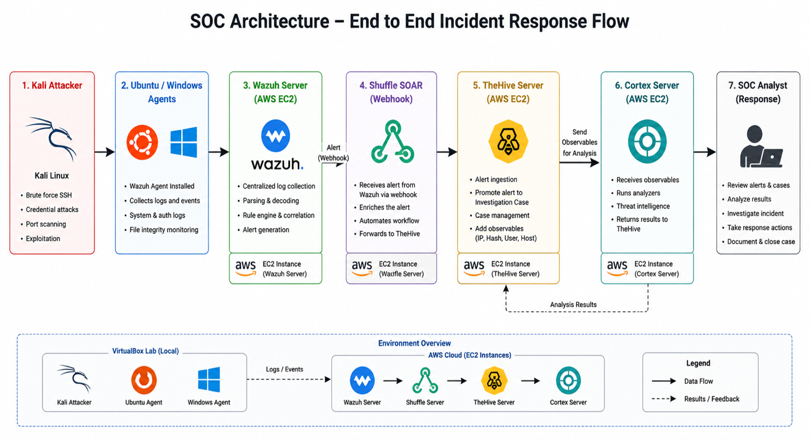
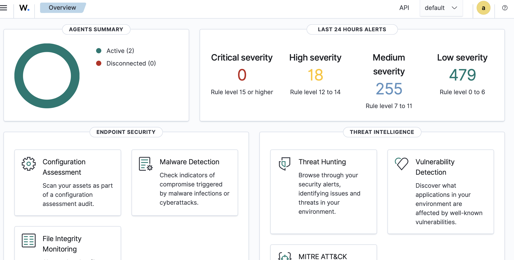
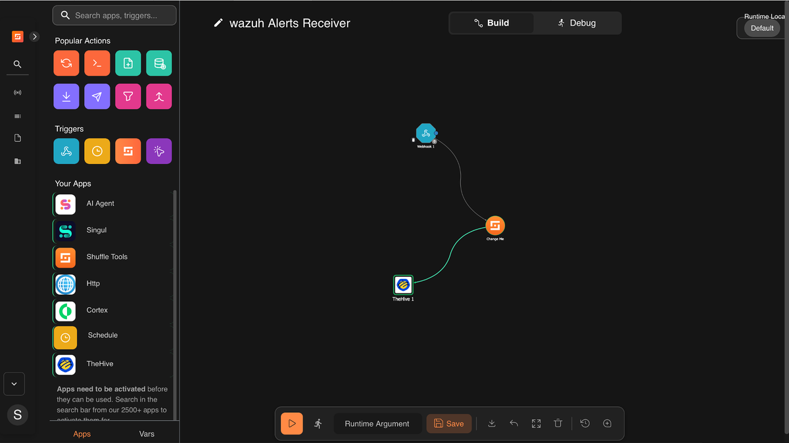
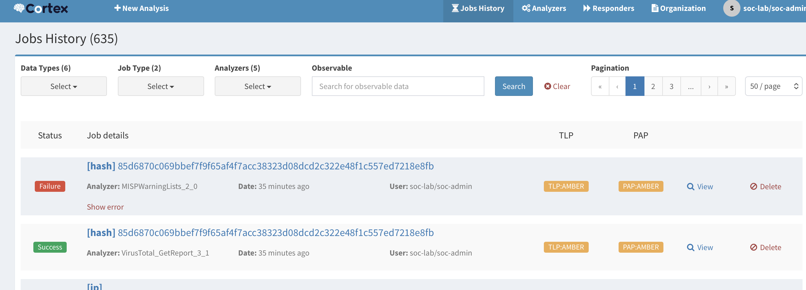
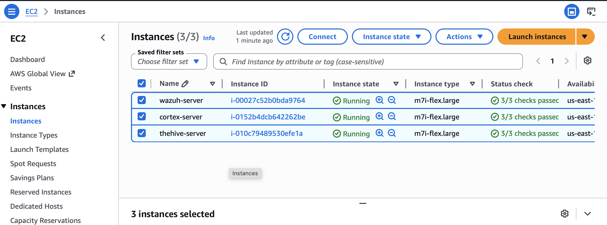
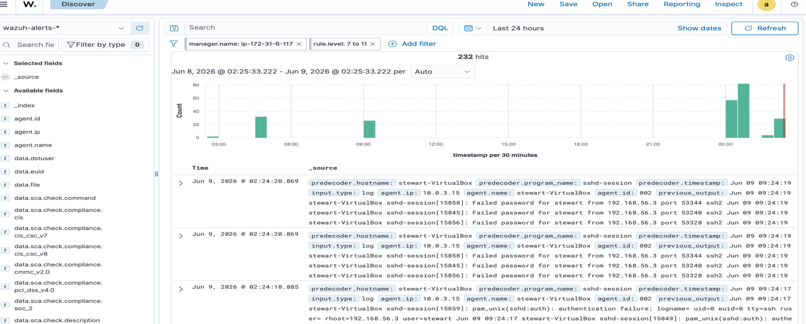
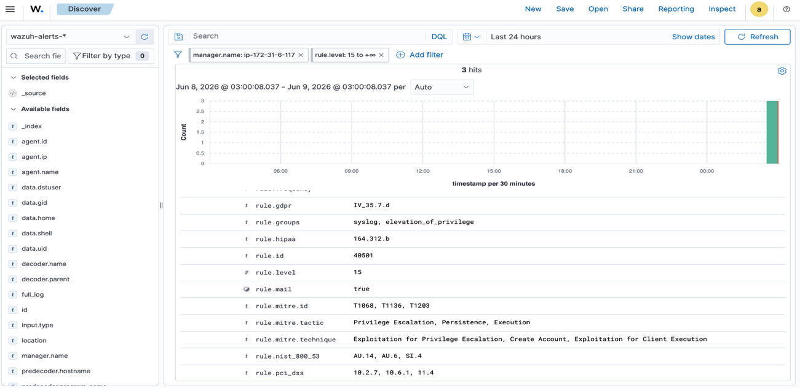
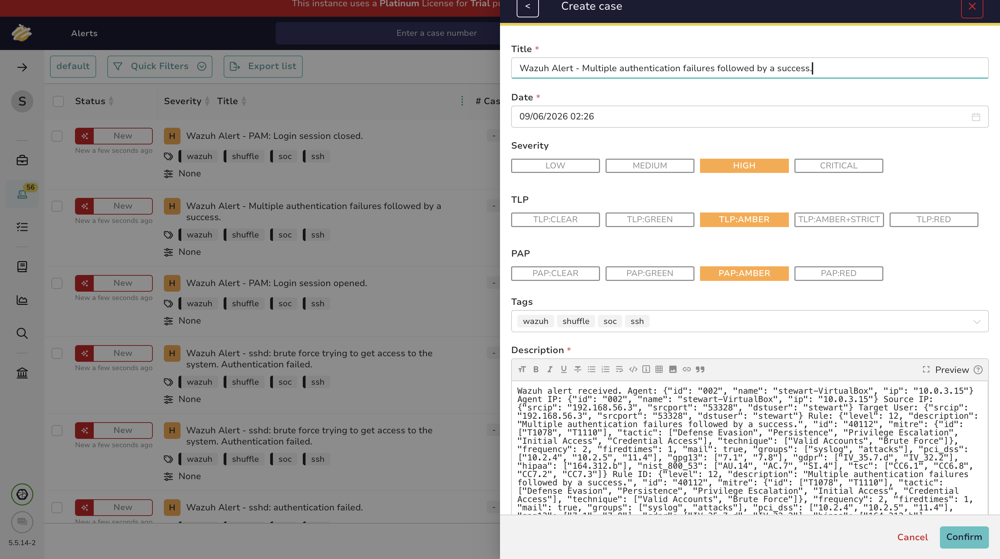
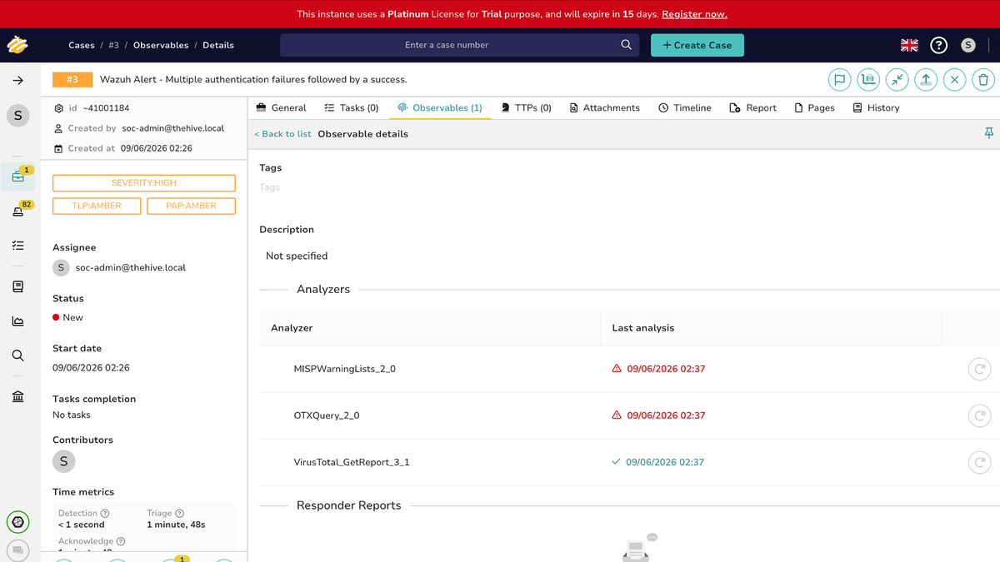

# Automated Hybrid SOC Incident Detection and Response Platform

> **From raw security event to structured investigation and response**

## Project Summary

I built this project to understand the complete lifecycle of a security investigation.

The platform connects Wazuh, Shuffle, TheHive, and Cortex into one working SOC pipeline. Wazuh detects activity on Windows and Linux systems, Shuffle receives and transforms the alerts, TheHive organizes them into structured investigations, and Cortex adds context to supported observables.

The goal was to build a complete workflow that could detect suspicious activity, automate alert handling, support investigation, and preserve analyst review before response decisions were made.

## Why I Built This

I wanted to understand what happens after a security event is detected.

My goal was to learn how alerts are collected, processed, enriched, documented, and managed from the moment suspicious activity occurs until an analyst has enough information to investigate and respond.

Building the full workflow helped me understand how SIEM, SOAR, case management, and enrichment platforms work together as one connected security operations process.

## Technologies Used

- Wazuh
- Shuffle SOAR
- TheHive
- Cortex
- AWS EC2
- Docker
- Ubuntu Linux
- Windows
- Kali Linux
- VirtualBox
- REST APIs
- Webhooks
- JSON
- MITRE ATT&CK

## Architecture

```text
Kali Linux
    │
    │ Controlled attack activity
    ▼
Windows and Ubuntu endpoints
    │
    │ Security logs and telemetry
    ▼
Wazuh Manager
    │
    │ Alert webhook
    ▼
Shuffle SOAR
    │
    │ Normalized alert
    ▼
TheHive
    │
    │ Case and observables
    ▼
Cortex
    │
    │ Enrichment results
    ▼
SOC analyst investigation and response
```

## Engineering Journey

### Step 1 — Design

I started by planning how each part of the platform would support the investigation process.

Wazuh would detect suspicious activity, Shuffle would automate the movement and transformation of alerts, TheHive would organize the investigation, and Cortex would enrich supported observables.

I used local VirtualBox machines to generate activity while the central security platforms ran in AWS. This created a hybrid environment and allowed me to test how events moved between local systems and cloud-hosted security services.

<p align="center">
  <a href="./assets/image-02.png">
    
  </a>
</p>

<p align="center"><em>Architecture of the hybrid SOC investigation platform.</em></p>

### Step 2 — Build

I installed Wazuh agents on the Windows and Ubuntu systems and connected them to the Wazuh manager so that security events could be collected centrally.

<p align="center">
  <a href="./assets/image-12.png">
    
  </a>
</p>

<p align="center"><em>Windows and Ubuntu endpoints connected to Wazuh.</em></p>

I then created a Shuffle workflow that received Wazuh alerts, extracted the important fields, and converted them into the format required by TheHive.

<p align="center">
  <a href="./assets/image-08.png">
    
  </a>
</p>

<p align="center"><em>Shuffle workflow used to process Wazuh alerts.</em></p>

After that, I connected Cortex so that supported observables such as hashes, public IP addresses, and domains could be analyzed during the investigation.

<p align="center">
  <a href="./assets/image-13.png">
    
  </a>
</p>

<p align="center"><em>Cortex analyzers available for observable enrichment.</em></p>

### Step 3 — Secure

I kept API keys and service credentials outside the public repository and limited network access to the ports required by each platform.

All attack activity was performed only against systems inside my own lab environment.

I also kept a human-review step before selected alerts were promoted into formal investigation cases.

<p align="center">
  <a href="./assets/image-14.png">
    
  </a>
</p>

<p align="center"><em>VirtualBox environment used to generate controlled security events.</em></p>

### Step 4 — Test

I generated several controlled events, including failed SSH login attempts, successful SSH access, and privilege-related activity.

For each scenario, I checked the event at every stage of the workflow instead of assuming the entire pipeline was working.

<p align="center">
  <a href="./assets/image-06.png">
    
  </a>
</p>

<p align="center"><em>Failed SSH login activity detected in the lab.</em></p>

<p align="center">
  <a href="./assets/image-07.png">
    
  </a>
</p>

<p align="center"><em>Privilege-related activity generated for testing.</em></p>

### Step 5 — Validate

I confirmed that Wazuh detected the event, Shuffle received and processed the payload, TheHive created a readable alert, and Cortex returned results for supported observables.

<p align="center">
  <a href="./assets/image-15.png">
    
  </a>
</p>

<p align="center"><em>Alert successfully created in TheHive.</em></p>

I then promoted selected alerts into cases and documented the investigation steps and enrichment results.

<p align="center">
  <a href="./assets/image-10.png">
    
  </a>
</p>

<p align="center"><em>Alert investigation after running Cortex analyzers.</em></p>

## Challenges & Troubleshooting

### TheHive Rejected the Alert Payload

My first Shuffle requests returned an `Invalid JSON` error.

The issue was the structure of the request body rather than the alert itself. I reviewed the required fields, corrected the data types, and created a unique `sourceRef` value before TheHive accepted the alert.

### Managing Service Dependencies

TheHive and Cortex depended on supporting database and search services.

I had to troubleshoot storage pressure, unhealthy containers, hostname resolution, service startup order, and communication between the different components before the platform worked reliably.

### Limited Enrichment for Private IP Addresses

Most of the systems in my lab used private IP addresses.

Public reputation services could not provide meaningful intelligence for those addresses, so an empty Cortex result did not necessarily mean an analyzer had failed. It often meant that no public reputation data existed for the observable.

## Results

- Centralized Windows and Linux security events in Wazuh
- Forwarded selected alerts automatically through Shuffle
- Created structured alerts and cases in TheHive
- Analyzed supported observables with Cortex
- Documented investigation timelines and response actions
- Reduced manual copying between security platforms
- Validated the complete workflow using controlled attack scenarios

## Lessons Learned

This project helped me understand that detection is only one part of a security investigation.

The investigation becomes useful when the alert is validated, additional context is collected, the evidence is documented, and the analyst can make a clear response decision.

I also gained hands-on experience troubleshooting APIs, webhooks, JSON payloads, containerized services, and communication between multiple security platforms.

## Project Gallery

Additional screenshots and supporting images are available in the [`assets`](./assets/) folder.

## Video Demonstration

Add the project demonstration link here.
