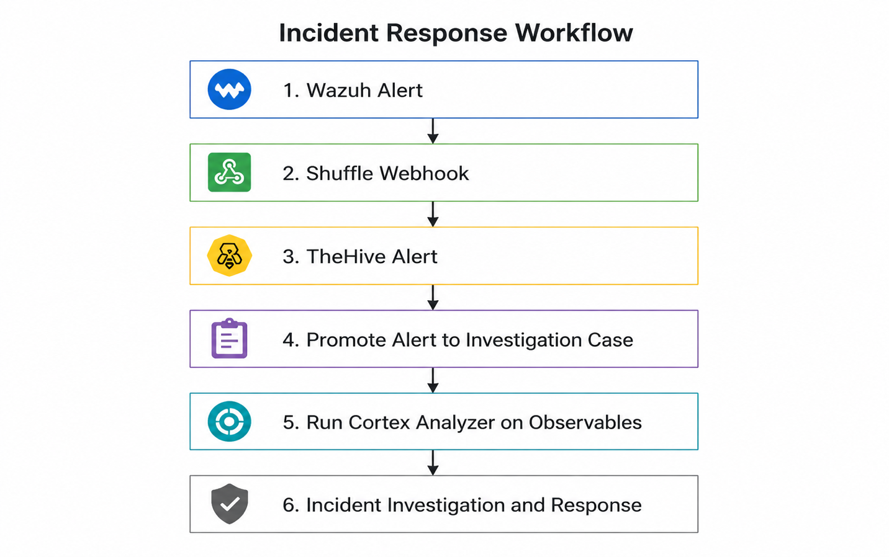
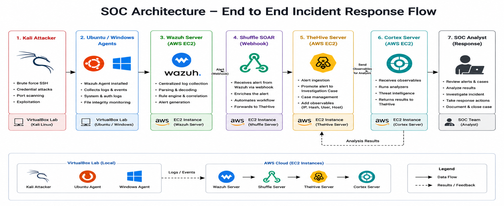
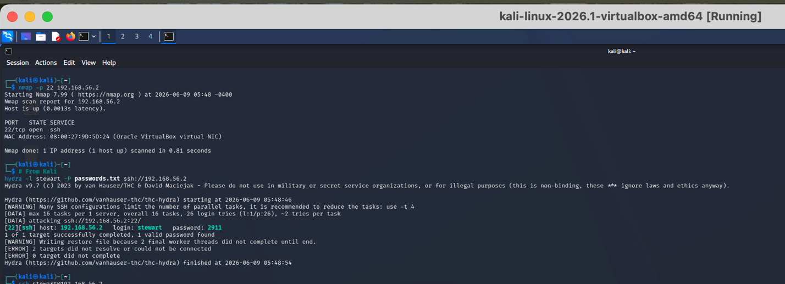
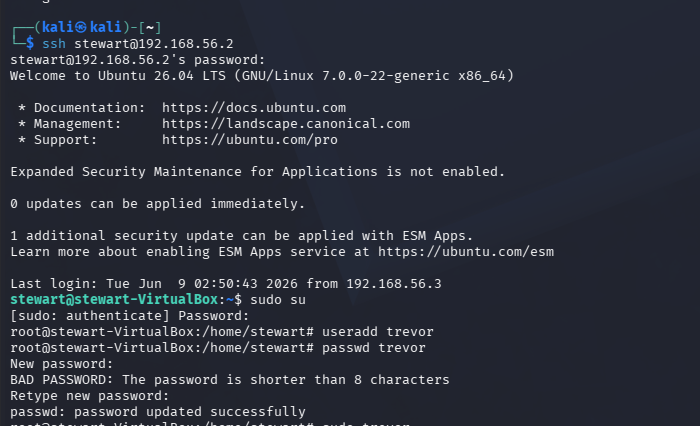
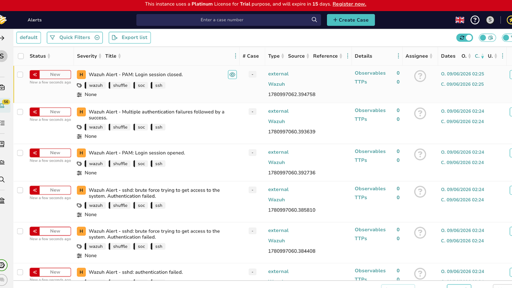
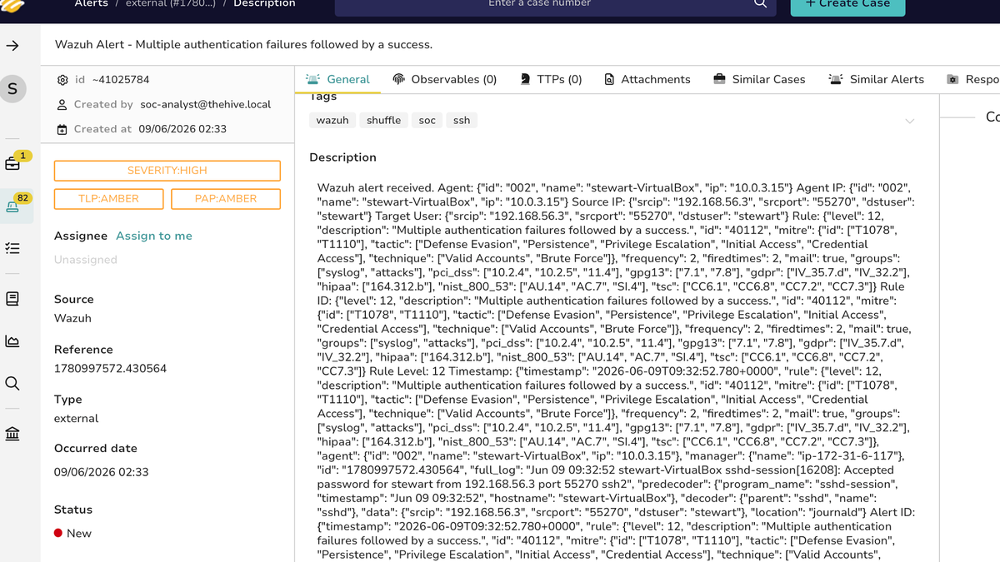

# Automated Hybrid SOC Incident Detection and Response Platform

> **Professional Banner**  
> **From raw security event to structured investigation and response**

## Project Summary

I built this project to understand what really happens after a security alert is generated.

The lab connects Wazuh, Shuffle, TheHive, and Cortex into one working SOC pipeline. Wazuh detects activity on Windows and Linux systems, Shuffle moves and transforms the alert, TheHive turns it into an investigation case, and Cortex adds context to supported observables.

The goal was not simply to make tools talk to each other. I wanted to recreate the way a real analyst receives an alert, validates it, gathers evidence, documents the investigation, and decides what happens next.

## Why I Built This

A lot of beginner SOC projects end when an alert appears on a dashboard. In a real environment, that is only the beginning.

An analyst still needs to understand the event, decide whether it matters, collect supporting evidence, assign severity, document actions, and close the case properly. I built this platform to practice that full workflow instead of focusing on detection alone.

## Technologies Used

- Wazuh
- Shuffle SOAR
- TheHive
- Cortex
- AWS EC2
- Ubuntu Linux
- Windows
- Kali Linux
- VirtualBox
- REST APIs and webhooks
- JSON
- MITRE ATT&CK

## Architecture

```text
Kali Linux
    │
    │ Controlled attack activity
    ▼
Windows and Ubuntu endpoints
    │
    │ Security logs and telemetry
    ▼
Wazuh Manager
    │
    │ Alert webhook
    ▼
Shuffle SOAR
    │
    │ Normalized alert
    ▼
TheHive
    │
    │ Case and observables
    ▼
Cortex
    │
    │ Enrichment results
    ▼
SOC analyst investigation and response
```

## Engineering Journey

### Step 1 — Design

I broke the workflow into separate SOC functions: detection, automation, case management, enrichment, and analyst response.

The local VirtualBox machines generated the activity, while the central security platforms ran in AWS. This gave me a hybrid environment that was closer to how many real organizations operate.

### Step 2 — Build

I installed Wazuh agents on the monitored systems and connected them to the Wazuh manager. I then created a Shuffle workflow that received Wazuh alerts and mapped the important fields into the format expected by TheHive.

After that, I connected Cortex so that hashes, public IP addresses, and other supported observables could be analyzed from inside the investigation workflow.

### Step 3 — Secure

I kept API keys and credentials out of the public repository and restricted network access to the ports required by each service.

All attack activity was performed only against systems inside my own lab. I also kept a human-review step before an alert became a formal case.

### Step 4 — Test

I generated several controlled events, including failed SSH logins, successful SSH access, file-integrity changes, Windows authentication activity, and privilege-related events.

For each scenario, I checked the event at every stage instead of assuming the complete pipeline worked.

### Step 5 — Validate

I confirmed that Wazuh detected the event, Shuffle received the payload, TheHive created a readable alert, and Cortex returned results for supported observables.

I then promoted selected alerts into cases and documented the investigation, containment, and remediation steps.

## Challenges & Troubleshooting

### TheHive rejected the alert payload

My first Shuffle requests returned an `Invalid JSON` error. The problem was not the alert itself; it was the structure of the request body. I corrected the required fields, data types, and unique `sourceRef` value.

### The services depended on each other

TheHive and Cortex relied on supporting database and search services. Storage pressure, container health, hostname resolution, and startup order all caused failures at different points.

### Private IP addresses produced little enrichment

Public reputation tools cannot provide useful intelligence about private lab addresses. I learned that an empty result does not automatically mean an analyzer is broken.

## Results

- Centralized Windows and Linux security events in Wazuh
- Forwarded selected alerts automatically through Shuffle
- Created structured alerts and cases in TheHive
- Analyzed supported observables with Cortex
- Documented investigation timelines and response actions
- Reduced manual copying between security platforms

## Lessons Learned

The biggest lesson was that a SOC is a process, not a dashboard.

Detection tells the analyst that something happened. The real value comes from validating the alert, adding context, documenting the evidence, and making a defensible response decision.

## Project Gallery

<p align="center">
  <a href="./assets/image-01.png">
    
  </a>

  <a href="./assets/image-02.png">
    
  </a>

  <a href="./assets/image-03.png">
    
  </a>

  <a href="./assets/image-04.png">
    
  </a>

  <a href="./assets/image-05.png">
    
  </a>

  <a href="./assets/image-06.png">
    
  </a>

  <a href="./assets/image-07.png">
    
  </a>

  <a href="./assets/image-08.png">
    
  </a>

  <a href="./assets/image-09.png">
    
  </a>

  <a href="./assets/image-10.png">
    
  </a>

  <a href="./assets/image-11.png">
    
  </a>
</p>

<p align="center"><em>Click any image to open the full-size version.</em></p>
## Video Demonstration

Add the project demonstration link here.
