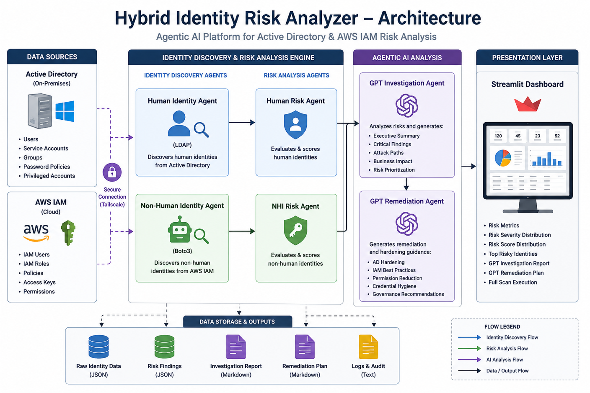

# Hybrid Identity Risk Analyzer with Agentic AI

> **Professional Banner**  
> **One view of identity risk across Active Directory and AWS IAM**

## Project Summary

I built a hybrid identity-security platform that analyzes both Microsoft Active Directory and AWS IAM.

The application collects human and cloud identity data, looks for risky configurations, calculates a risk score, and uses AI to explain why a finding matters and what should be done next. The results are presented in a Streamlit dashboard where an analyst can run a scan and review high-risk identities.

The AI does not decide whether an identity is risky. That decision comes from deterministic rules. AI is used after the analysis to turn the technical findings into a clear investigation and remediation report.

## Why I Built This

Identity attacks often cross more than one environment. A company may have privileged users in Active Directory, long-lived IAM users in AWS, service accounts with weak settings, and no single place to review the combined risk.

I wanted to build something that treated identity as one security problem rather than separating on-premises and cloud accounts into unrelated reports.

## Technologies Used

- Microsoft Active Directory
- AWS IAM
- Python
- ldap3
- boto3
- Streamlit
- OpenAI API
- Tailscale
- JSON
- Risk-scoring logic
- Least-privilege access

## Architecture

```text
Active Directory
      │ LDAP
      ▼
Human Identity Agent
      │
      ├──────────────┐
      │              │
AWS IAM              │
      │ boto3        │
      ▼              │
Cloud Identity Agent │
      │              │
      └──────┬───────┘
             ▼
      Correlation Agent
             ▼
       Risk Scoring Agent
             ▼
    AI Investigation Agent
             ▼
     AI Remediation Agent
             ▼
     Streamlit Dashboard
```

## Engineering Journey

### Step 1 — Design

I separated the platform into focused components. One agent collected Active Directory data, another collected AWS IAM data, and later stages handled normalization, scoring, investigation, and remediation guidance.

This made the system easier to test and helped prevent AI from becoming responsible for the actual risk decision.

### Step 2 — Build

I created a Windows Server Active Directory lab with users, groups, privileged accounts, and intentionally risky settings.

A read-only account collected users and group membership through LDAP. The AWS component used boto3 to enumerate IAM users, roles, policies, access keys, and administrative permissions.

I then normalized both data sources into a common format.

### Step 3 — Secure

The Active Directory account used by the application had read-only access. AWS permissions were limited to identity inventory and assessment.

Tailscale provided private connectivity between the AWS-hosted application and my local domain controller, which avoided exposing LDAP directly to the internet.

### Step 4 — Test

I created test conditions such as:

- Membership in privileged Active Directory groups
- Password Never Expires
- Disabled accounts
- Long-lived IAM users
- AdministratorAccess policies
- Weak service-account configurations

I tested each component separately before running the complete scan.

### Step 5 — Validate

I checked that every finding included the identity, score, severity, reasons, and recommended action.

I also reviewed the AI reports to confirm they were based on the actual risk data rather than making unsupported assumptions.

## Challenges & Troubleshooting

### Connecting AWS to the local domain controller

The application initially could not reach Active Directory. I worked through Tailscale routing, Windows firewall rules, LDAP ports, and service-account permissions until the connection succeeded.

### Active Directory and AWS use different identity models

A domain user and an IAM role are not the same thing. I had to normalize the useful security attributes without pretending the environments were identical.

### Making the AI output specific

Early reports were too generic. I improved them by passing the exact identity attributes, risk reasons, severity, and known limitations into the prompt.

## Results

- Collected Active Directory users and group membership through LDAP
- Inventoried AWS IAM users, roles, policies, and access keys
- Identified privileged and weakly configured identities
- Assigned a consistent score and severity to each finding
- Generated AI-assisted investigation and remediation reports
- Presented the findings through a Streamlit dashboard

## Lessons Learned

Identity risk only makes sense when it is viewed in context.

A disabled account is not equal to an active administrator with a non-expiring password. Likewise, a long-lived IAM user with full administrative access deserves much more attention than a tightly scoped role.

I also learned that AI is most useful after reliable data collection and rule-based analysis are already in place.

## Project Gallery

<p align="center">
  <a href="./assets/image-01.png">
    
  </a>
</p>

<p align="center"><em>Click any image to open the full-size version.</em></p>
## Video Demonstration

Add the project demonstration link here.
