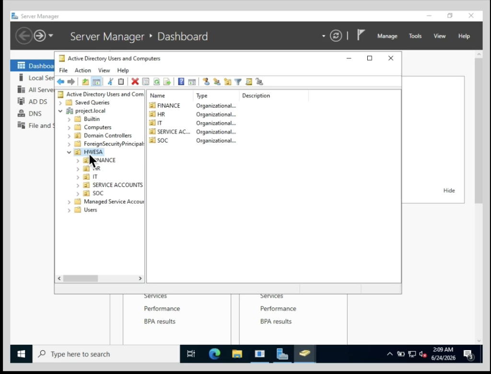
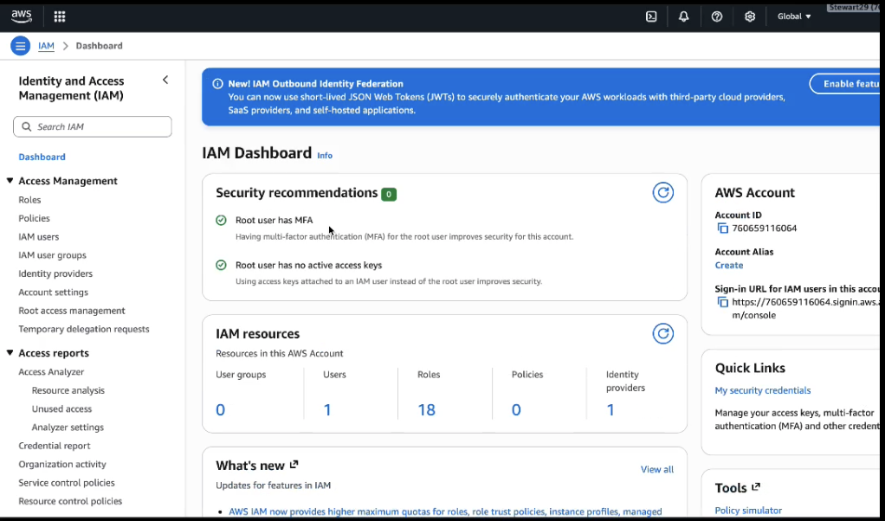
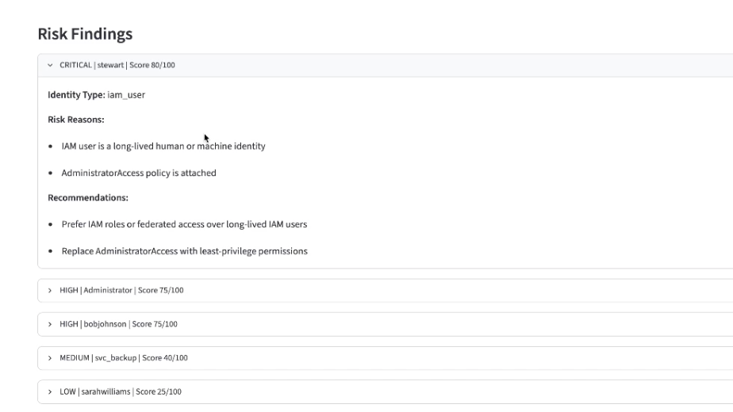
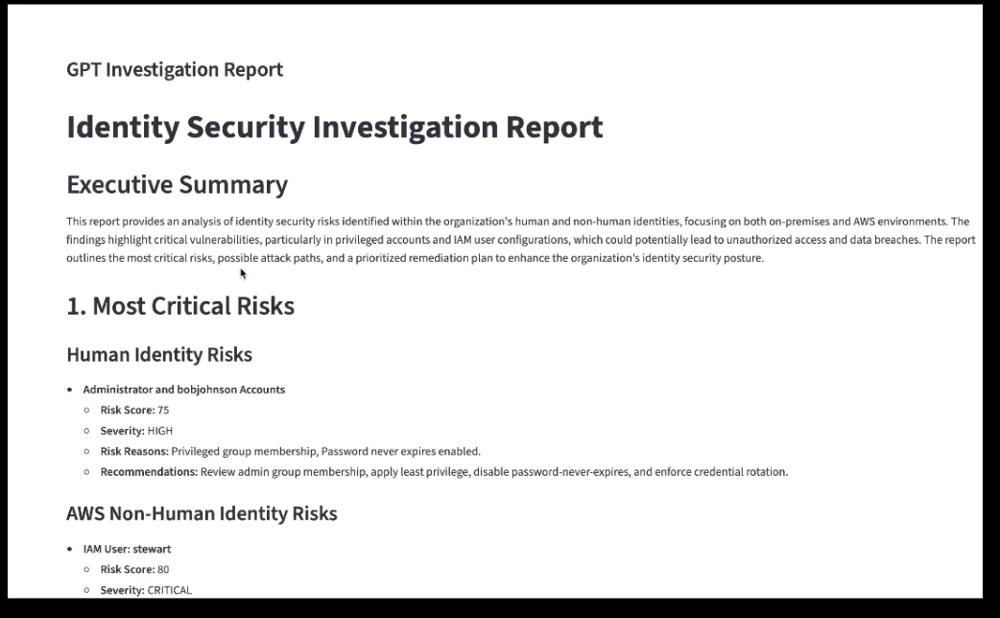

# Hybrid Identity Risk Analyzer with Agentic AI

> **One view of identity risk across Active Directory and AWS IAM**

## Project Summary

I built this platform to assess identity risk across both Microsoft Active Directory and AWS IAM.

The application collects identity data from each environment, checks for risky configurations, assigns a risk score, and uses AI to explain why a finding matters and what should be done next. The results are displayed in a Streamlit dashboard where an analyst can run a scan, review high-risk identities, and open detailed investigation and remediation reports.

The risk decision is based on defined rules and identity attributes. AI is used after the analysis to explain the findings in clear language and provide practical remediation guidance.

## Why I Built This

I wanted to understand how identity risk could be reviewed across both on-premises and cloud environments.

My goal was to bring Active Directory and AWS IAM findings into one workflow so that privileged accounts, long-lived credentials, weak account settings, and excessive permissions could be reviewed together instead of as separate reports.

Building the platform helped me understand how identity data can be collected, normalized, scored, investigated, and presented in a way that supports security analysis.

## Technologies Used

- Microsoft Active Directory
- AWS IAM
- Python
- ldap3
- boto3
- Streamlit
- OpenAI API
- Tailscale
- JSON
- Rule-based risk scoring
- Least-privilege access

## Architecture

```text
Active Directory
      │ LDAP
      ▼
Human Identity Agent
      │
      ├──────────────┐
      │              │
AWS IAM              │
      │ boto3        │
      ▼              │
Cloud Identity Agent │
      │              │
      └──────┬───────┘
             ▼
      Correlation Agent
             ▼
       Risk Scoring Agent
             ▼
    AI Investigation Agent
             ▼
     AI Remediation Agent
             ▼
     Streamlit Dashboard
```

## Engineering Journey

### Step 1 — Design

I divided the platform into separate components so that each stage had a clear responsibility.

One component collected Active Directory data, another collected AWS IAM data, and the remaining stages handled normalization, correlation, risk scoring, investigation, and remediation guidance.

Keeping the risk-scoring logic separate from the AI made the workflow easier to test and ensured that the final severity was based on defined rules rather than generated text.

<p align="center">
  <a href="./assets/image-00.png">
    
  </a>
</p>

<p align="center"><em>Architecture of the hybrid identity-risk analysis workflow.</em></p>

### Step 2 — Build

I created a Windows Server Active Directory lab with users, groups, privileged accounts, and intentionally risky settings.

A read-only service account collected user details and group memberships through LDAP. The AWS component used boto3 to collect IAM users, roles, policies, access keys, and administrative permissions.

I then converted the important fields from both environments into a common format so they could be assessed through the same risk workflow.

<p align="center">
  <a href="./assets/image-07.png">
    
  </a>
</p>

<p align="center"><em>Active Directory identities collected for analysis.</em></p>

<p align="center">
  <a href="./assets/image-06.png">
    
  </a>
</p>

<p align="center"><em>AWS IAM identities and permissions collected for analysis.</em></p>

### Step 3 — Secure

The Active Directory account used by the application had read-only access, while the AWS permissions were limited to identity inventory and assessment.

Tailscale provided private connectivity between the AWS-hosted application and the local domain controller, which allowed the platform to query LDAP without exposing the service directly to the internet.

Credentials and API keys were stored outside the public repository.

### Step 4 — Test

I created several identity-risk conditions to test the platform:

- Membership in privileged Active Directory groups
- Passwords configured to never expire
- Disabled accounts
- Long-lived IAM users
- AdministratorAccess policies
- Weak service-account configurations

I tested each component separately before running the complete scan so that collection, scoring, and reporting problems could be isolated more easily.

<p align="center">
  <a href="./assets/image-01.png">
    
  </a>
</p>

<p align="center"><em>Complete scan across Active Directory and AWS IAM.</em></p>

### Step 5 — Validate

I confirmed that each finding included the identity, risk score, severity, reasons, and recommended action.

<p align="center">
  <a href="./assets/image-05.png">
    
  </a>
</p>

<p align="center"><em>Identity findings with scores, severity, and risk reasons.</em></p>

I also reviewed the AI-generated reports to confirm that they matched the actual identity data and did not introduce unsupported claims.

<p align="center">
  <a href="./assets/image-02.png">
    
  </a>
</p>

<p align="center"><em>AI-assisted investigation and remediation reports.</em></p>

## Challenges & Troubleshooting

### Connecting AWS to the Local Domain Controller

The application could not initially reach Active Directory.

I worked through Tailscale routing, Windows firewall rules, LDAP connectivity, and service-account permissions until the AWS-hosted application could query the domain controller successfully.

### Normalizing Different Identity Models

Active Directory and AWS IAM represent identities differently.

A domain user, an IAM user, and an IAM role do not share the same fields or purpose. I created a common structure for the security attributes that mattered while keeping the differences between each identity type clear.

### Making the AI Output Specific

The first AI reports were too general.

I improved them by passing the exact identity attributes, risk reasons, severity, and known limitations into the prompt. This produced reports that were more useful and easier to validate.

## Results

- Collected Active Directory users and group memberships through LDAP
- Inventoried AWS IAM users, roles, policies, and access keys
- Identified privileged and weakly configured identities
- Assigned a consistent risk score and severity to each finding
- Generated AI-assisted investigation and remediation reports
- Presented findings through a Streamlit dashboard
- Connected local Active Directory and AWS through private networking
- Kept the final risk decision based on defined rules

## Lessons Learned

This project helped me understand that identity risk depends on both privilege and context.

A disabled account does not present the same risk as an active administrator with a non-expiring password. In the same way, a long-lived IAM user with full administrative access requires more attention than a tightly scoped role.

I also learned that AI is most useful after reliable data collection and rule-based analysis are already in place. The quality of the report depends on the quality of the identity data and risk logic that come before it.

## Video Demonstration

