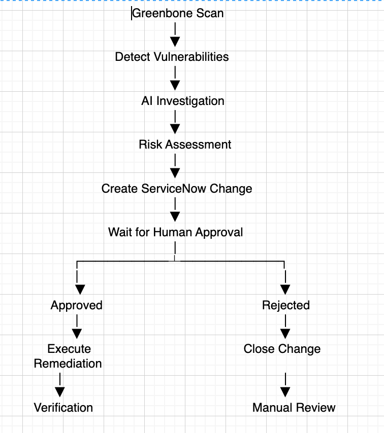
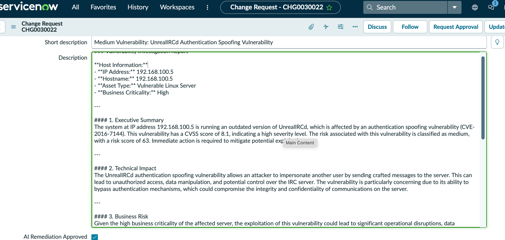
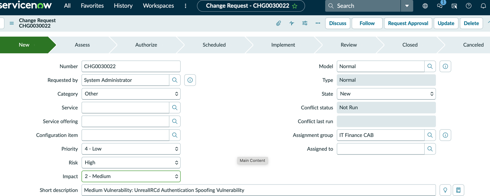

# AI-Assisted Vulnerability Management and Automated Remediation Platform

> **Greenbone → AI Investigation → ServiceNow Approval → Remediation → Verification**

[]() []()

## Video Demonstration

🎥 **Watch the project walkthrough:** [Add video link here](VIDEO_LINK_HERE)

---

## Why I Built This

Vulnerability management is more than running a scanner. Findings need to be investigated, prioritized, approved, remediated, verified, and documented. I built this platform to automate that lifecycle while keeping a human approval step before any change is made.

## The Problem

Scanning, ticketing, remediation, and verification are often handled in separate tools, creating delays, inconsistent documentation, and findings that remain open long after discovery.

## Architecture

```text
Greenbone → AI Investigation → ServiceNow Change → Human Approval → Linux/Windows/AD Playbook → Verification → ServiceNow Update
```

## How the Project Works

After a Greenbone scan, the platform collects and enriches findings, calculates risk, generates an AI investigation report, and creates a ServiceNow change request. Approved findings are matched against tested playbooks. Verification uses configuration checks, port validation, and follow-up scans when available.

## Key Capabilities

- Greenbone scanning
- AI risk assessment
- Automatic ServiceNow changes
- Human approval
- Linux, Windows, and AD playbooks
- Post-remediation verification
- Safe escalation for unsupported findings

## Results

The platform completed supported remediation end to end. When no approved playbook matched a finding, it intentionally refused to make changes, updated ServiceNow, and escalated the item for manual review. This demonstrated that safe automation matters more than automating everything.

## Skills Demonstrated

OpenVAS, Greenbone API, Python, OpenAI, ServiceNow REST API, SSH, WinRM, Windows, Linux, Active Directory, remediation automation, change control.

## Project Gallery










## What I Learned

This project strengthened my ability to connect technical controls to a real security workflow. It also reinforced the importance of testing integrations end to end, documenting limitations honestly, and designing automation that supports analysts rather than hiding important decisions.

## Future Improvements

- Add more automated test coverage
- Improve dashboards and reporting
- Expand detection or risk logic
- Strengthen secrets management
- Add scheduled execution and notifications

---

## Author

**Stewart Nyamutswa**

Cybersecurity | SOC Operations | Cloud Security | Incident Response
