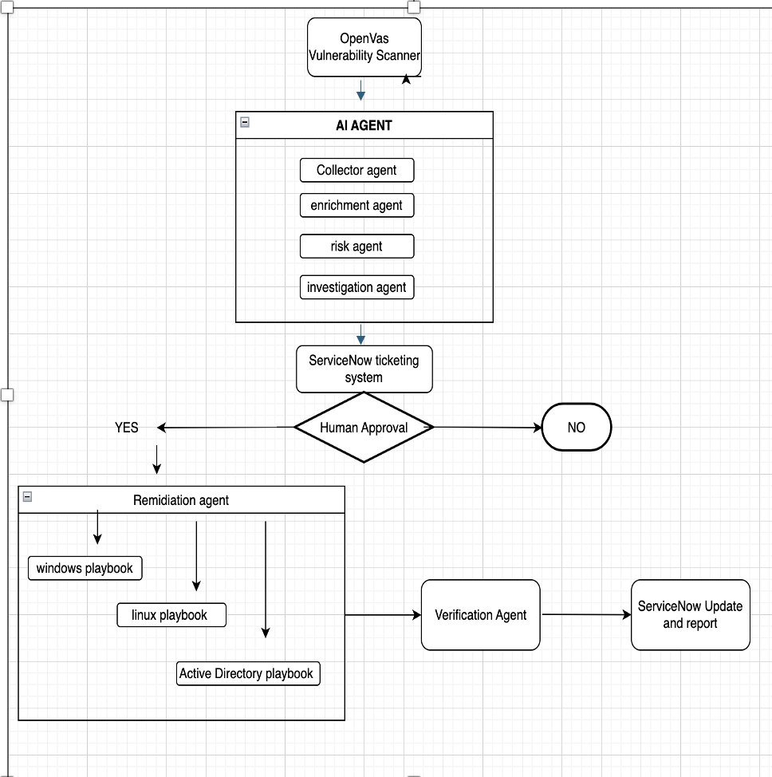
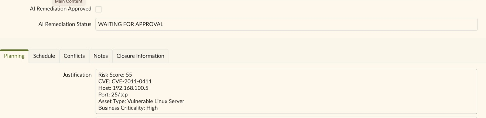
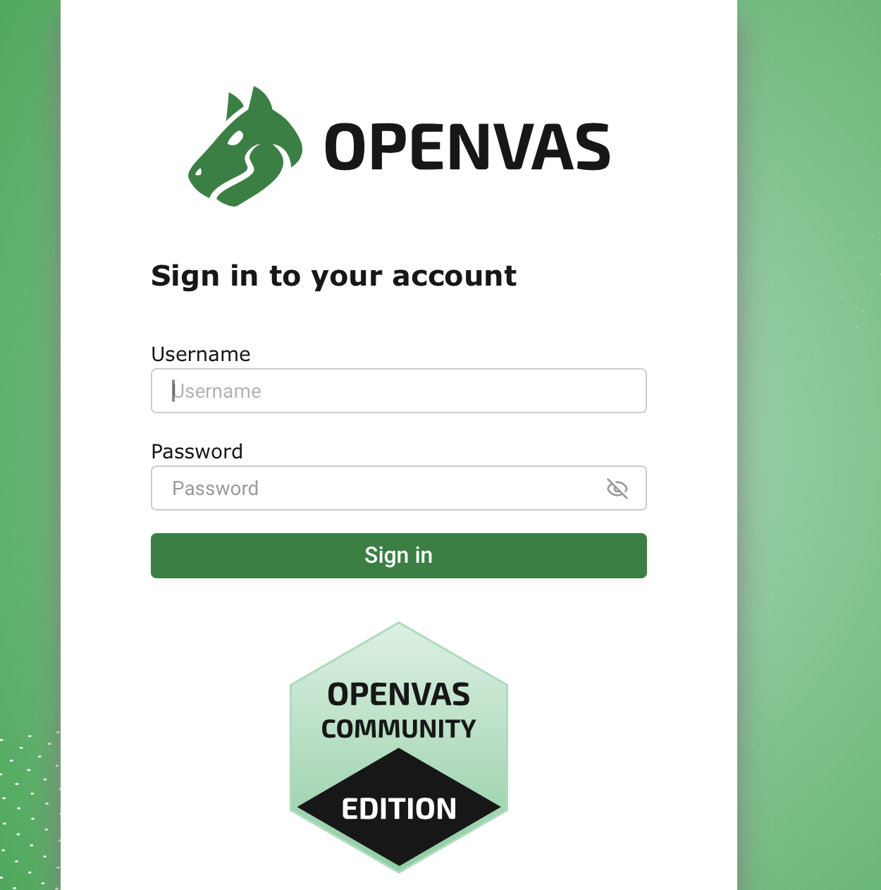
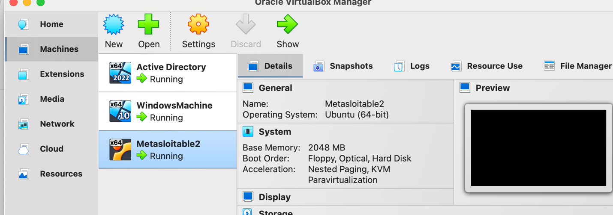
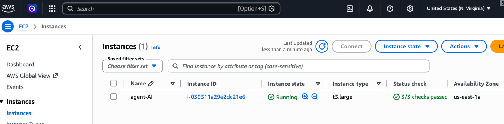
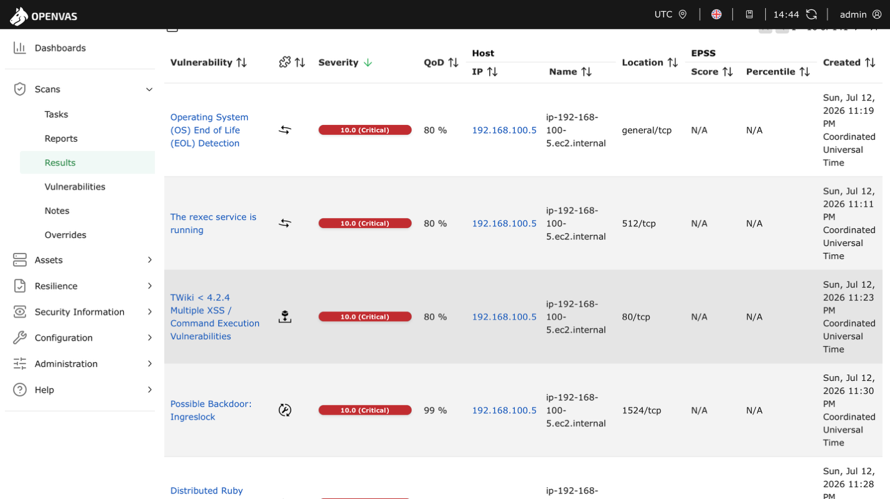
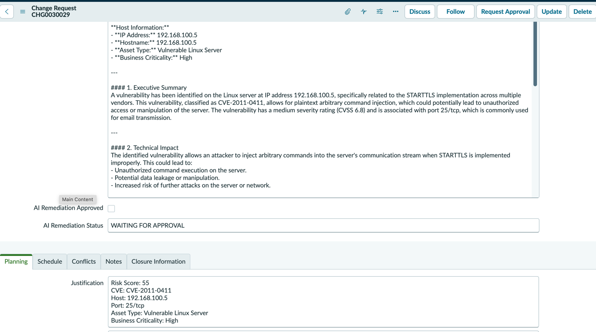
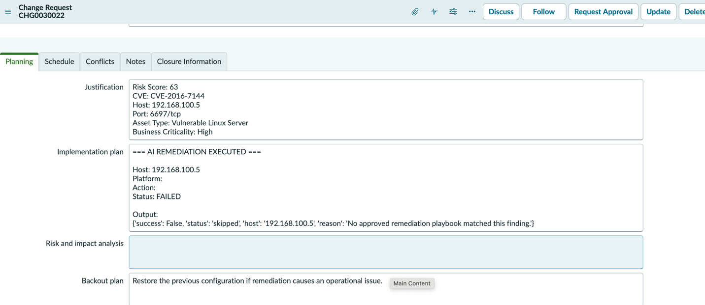

# AI-Assisted Vulnerability Management Platform

> **Find the weakness, approve the change, fix it, and prove it was fixed**

## Project Summary

This project follows a vulnerability from discovery to verified remediation.

Greenbone scans Windows, Linux, and Active Directory systems. Python components collect and prioritize the findings, AI helps explain the risk, ServiceNow records the change request and approval, and tested playbooks perform supported remediation. A verification stage then checks whether the change actually worked.

The design intentionally keeps a human approval step before any remediation is performed.

## Why I Built This

Running a vulnerability scanner is easy. Managing the result is the difficult part.

A security team still needs to decide which finding matters first, understand the business impact, create a ticket, obtain approval, apply the fix safely, and confirm the vulnerability is no longer present.

I built this platform to automate the repetitive parts without removing accountability or change control.

## Technologies Used

- Greenbone Community Edition
- OpenVAS
- Python
- OpenAI API
- ServiceNow REST API
- AWS EC2
- Docker
- Tailscale
- Windows Server 2022
- Active Directory
- Windows 11
- Metasploitable 2
- SSH and WinRM

## Architecture

```text
Windows, Linux, and Active Directory targets
                    │
                    ▼
          Greenbone / OpenVAS
                    │
                    ▼
          Finding Collector
                    │
                    ▼
       Risk and AI Investigation
                    │
                    ▼
        ServiceNow Change Request
                    │
              Human Approval
           ┌────────┴────────┐
           ▼                 ▼
        Rejected          Approved
           │                 │
           ▼                 ▼
     Manual review      Tested playbook
                             │
                             ▼
                     Verification stage
                             │
                             ▼
                    ServiceNow closure
```

## Engineering Journey

### Step 1 — Design

I designed the workflow around one rule: the system could discover and analyze a vulnerability automatically, but it could not make a production-style change without approval.
<p align="center">
  <a href="./assets/image-01.png">
    
  </a>
</p>
<p align="center"><em>ARCHITECTURE.</em></p>

The remediation component was limited to known and tested playbooks. Anything unsupported had to stop and be escalated.

### Step 2 — Build

I deployed OpenVAS Greenbone Community Edition in AWS using Docker Compose and connected it to my private VirtualBox lab through Tailscale.

I created Python components to collect findings, calculate risk, generate investigation reports, create ServiceNow requests, wait for approval, trigger supported playbooks, and record verification evidence.

<p align="center">
  <a href="./assets/image-09.jpg">
    
  </a>
</p>
<p align="center">waiting for approval.</em></p>

<p align="center">
  <a href="./assets/image-04.png">
    
  </a>
</p>
<p align="center">OpenVAS.</em></p>

<p align="center">
  <a href="./assets/image-05.png">
    
  </a>
</p>
<p align="center">VirtualBox.</em></p>

<p align="center">
  <a href="./assets/image-03.png">
    
  </a>
</p>
<p align="center">AWS Environment.</em></p>

### Step 3 — Secure

I designed the platform so that security came before automation. Service accounts were given only the permissions they needed, and sensitive credentials were stored securely.

The platform never attempted to create its own remediation steps. Instead, it only executed remediation actions that had been tested and approved. If no suitable remediation was available, the workflow stopped and required analyst review before any changes could be made.

### Step 4 — Test

I scanned intentionally vulnerable systems and tested findings involving insecure Linux services, missing patches, Active Directory account issues, and exposed services.

<p align="center">
  <a href="./assets/image-08.png">
    
  </a>
</p>
<p align="center">Metasploitable Scan Results.</em></p>

### Step 5 — Validate

After a supported remediation ran, the verification stage checked the system state and used a follow-up scan where appropriate.

<p align="center">
  <a href="./assets/image-09.png">
    
  </a>
</p>
<p align="center">ServiceNow Ticket before Human Approval.</em></p>

The result was written back to ServiceNow so the ticket showed the original finding, approval, remediation action, and final evidence.

<p align="center">
  <a href="./assets/image-10.png">
    
  </a>
</p>
<p align="center">ServiceNow Ticket After Human Approval.</em></p>

## Challenges & Troubleshooting

### Greenbone was not a single service

The platform depended on several containers, data feeds, a database, and scanner services. I had to work with ChatGPT for full installation.

### The cloud scanner could not initially reach the lab

Tailscale subnet routing and Windows IP forwarding had to be configured correctly before AWS could scan the VirtualBox network.

### Greenbone API examples did not match my version

While building the project, I found that many online examples didn't match the version of Greenbone I had installed. I tested the API responses from my own environment and updated the code until it worked correctly.

### Safe remediation matching

One challenge was making sure the platform didn't apply the wrong fix. I configured it to run only approved remediation actions for known vulnerabilities. If it couldn't find a trusted match, it stopped the process and waited for manual intervention.

## Results

- Scanned Windows, Linux, and Active Directory systems
- Normalized and prioritized vulnerability findings
- Generated AI-assisted investigation reports
- Created ServiceNow change requests through the REST API
- Required human approval before remediation
- Applied supported fixes using tested playbooks
- Verified the result after the change
- Escalated unsupported findings safely

## Lessons Learned

Good security automation is not the automation that does the most. It is the automation that behaves predictably and leaves a clear audit trail.

The approval gate, tested playbooks, verification step, and safe escalation path made the project more realistic than a system that simply tries to fix everything automatically.


## Video Demonstration

Add the project demonstration link here.
