# Secure Cloud-Native E-Commerce Platform on AWS

> **High Availability, Infrastructure as Code, Layered Security, and Monitoring**

[]() []()

## Video Demonstration

🎥 **Watch the project walkthrough:** [Add video link here](VIDEO_LINK_HERE)

---

## Why I Built This

I built this project to move beyond a basic website-hosting lab. The goal was to create a realistic cloud application combining application development, infrastructure as code, high availability, web protection, and centralized monitoring.

## The Problem

Internet-facing applications must remain available, protect customer-facing endpoints, separate public and private resources, preserve audit evidence, and give security teams visibility into suspicious activity.

## Architecture

```text
User → Route 53 → CloudFront → AWS WAF → ALB → EC2 Auto Scaling → RDS PostgreSQL
S3 → Product Images
Monitoring: CloudWatch | CloudTrail | GuardDuty | Security Hub | AWS Config
```

## How the Project Works

I used CloudFormation to deploy the environment as logical stacks. Traffic is routed through Route 53 and CloudFront, inspected by AWS WAF, and distributed across two EC2 web servers. Flask runs behind Nginx and Gunicorn. RDS stores application data and S3 stores product images. I also performed controlled Nmap, Gobuster, and SQL injection validation.

## Key Capabilities

- Multi-tier AWS architecture
- CloudFormation
- CloudFront and Route 53
- AWS WAF
- ALB and healthy EC2 targets
- Private RDS PostgreSQL
- S3 asset storage
- GuardDuty and Security Hub

## Results

The final environment included a working custom-domain e-commerce site, two healthy EC2 servers behind an ALB, private PostgreSQL, S3 images, WAF protection, centralized monitoring, and repeatable deployment. Troubleshooting health checks, routing, permissions, and connectivity was the most valuable part.

## Skills Demonstrated

AWS, CloudFormation, VPC, WAF, CloudFront, ALB, EC2, RDS, S3, GuardDuty, Security Hub, CloudWatch, CloudTrail, Flask, Nginx, Gunicorn.

## Project Gallery

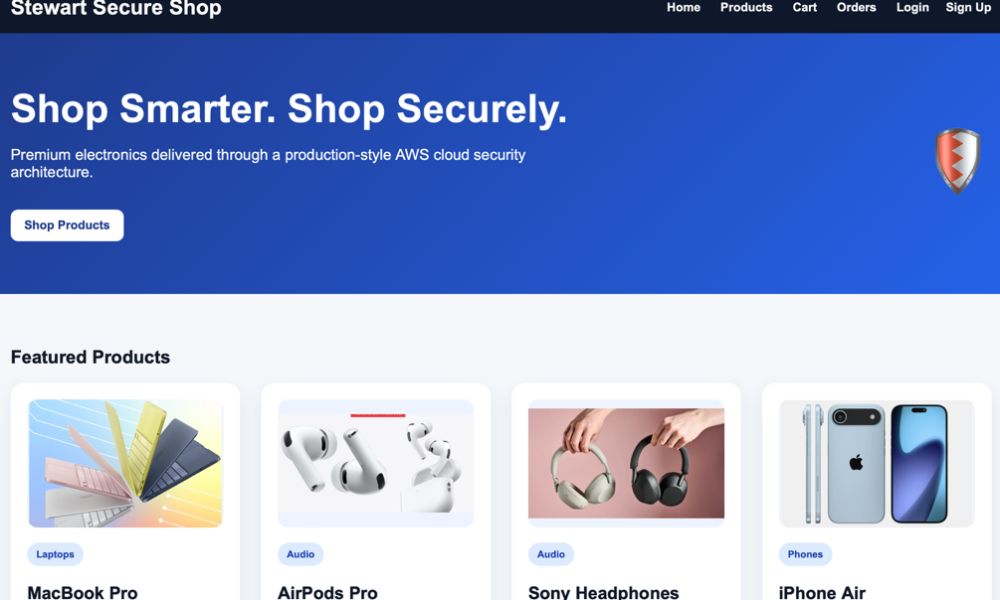

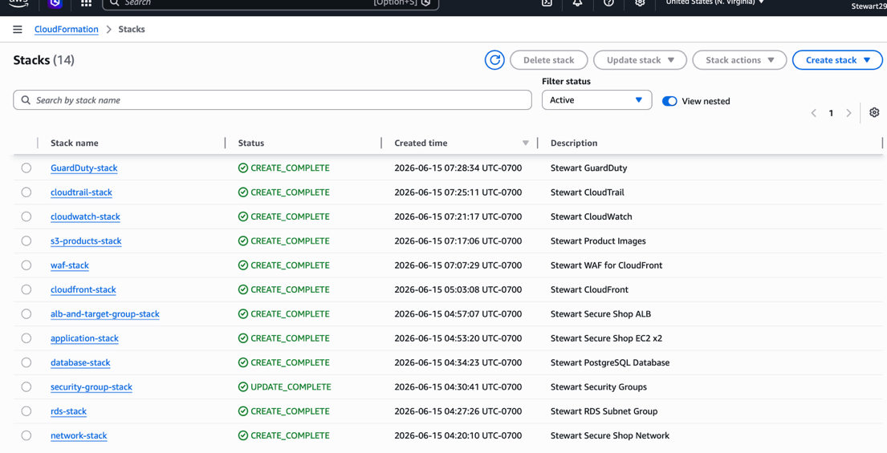

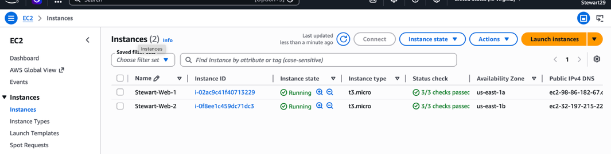

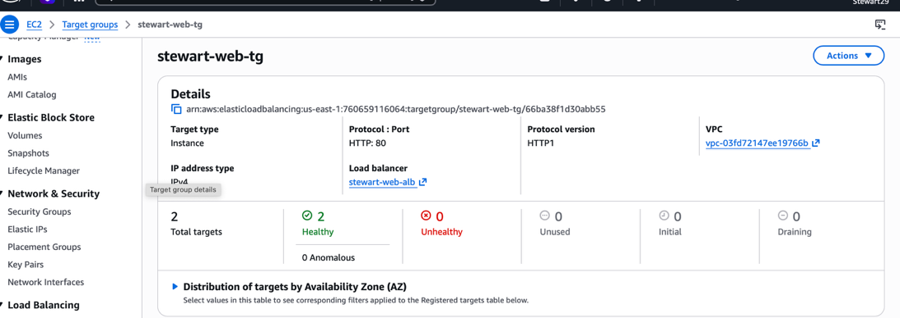

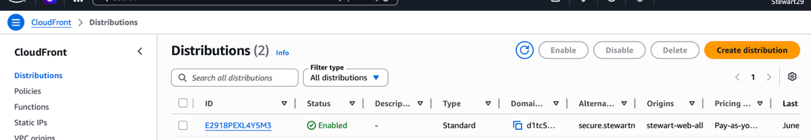

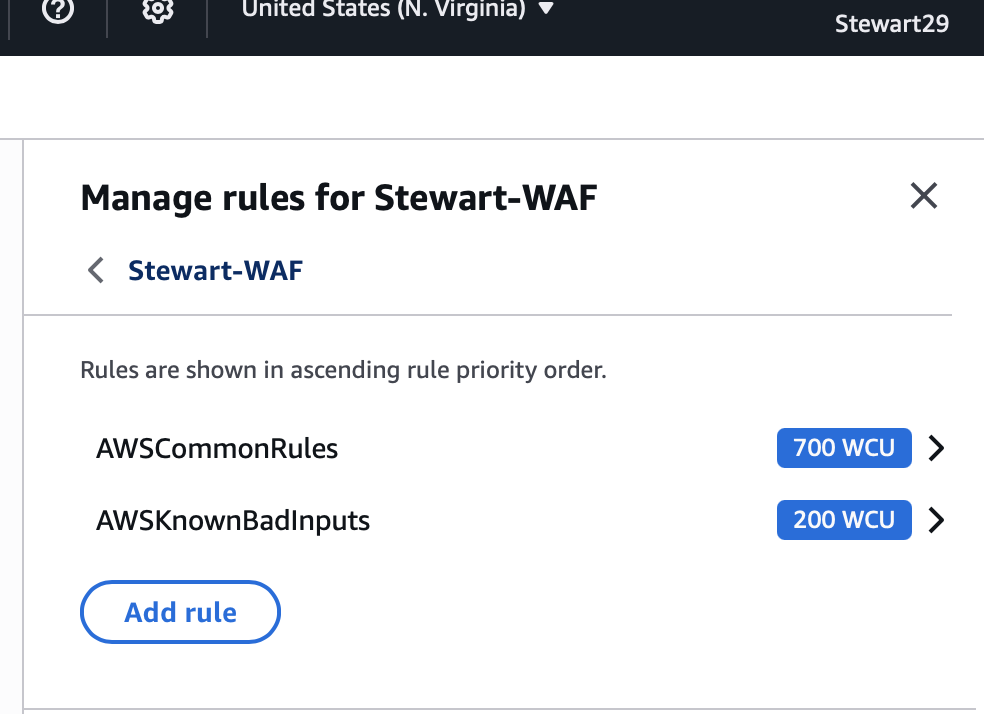

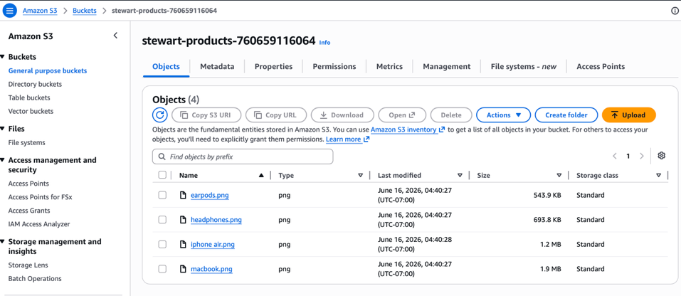

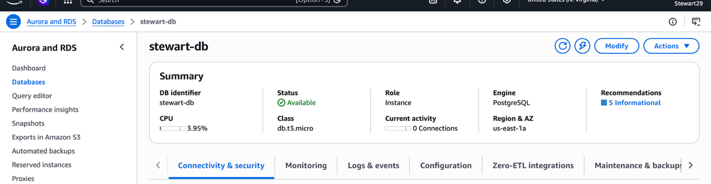

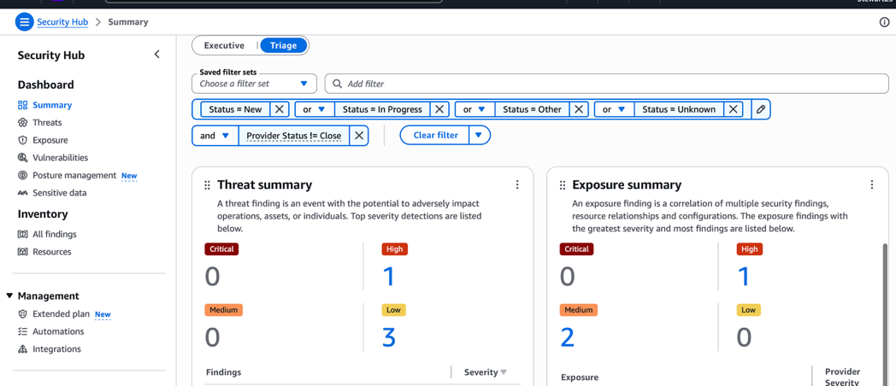

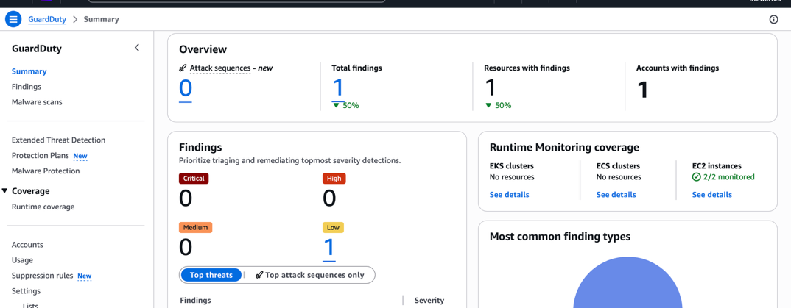

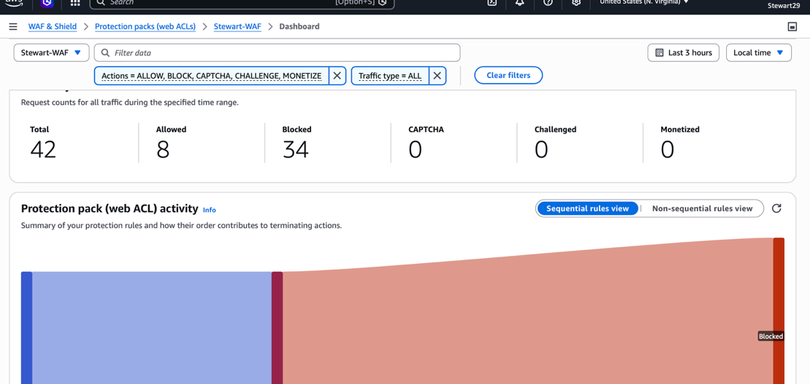

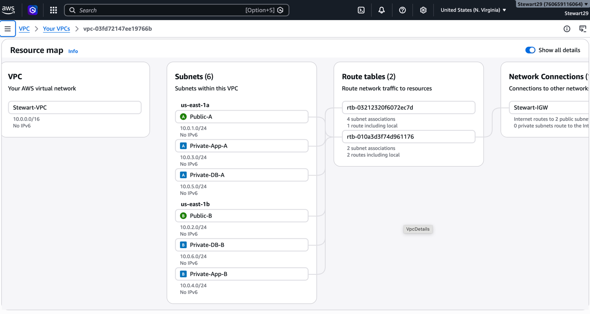

## What I Learned

This project strengthened my ability to connect technical controls to a real security workflow. It also reinforced the importance of testing integrations end to end, documenting limitations honestly, and designing automation that supports analysts rather than hiding important decisions.

## Future Improvements

- Add more automated test coverage
- Improve dashboards and reporting
- Expand detection or risk logic
- Strengthen secrets management
- Add scheduled execution and notifications

---

## Author

**Stewart Nyamutswa**

Cybersecurity | SOC Operations | Cloud Security | Incident Response
