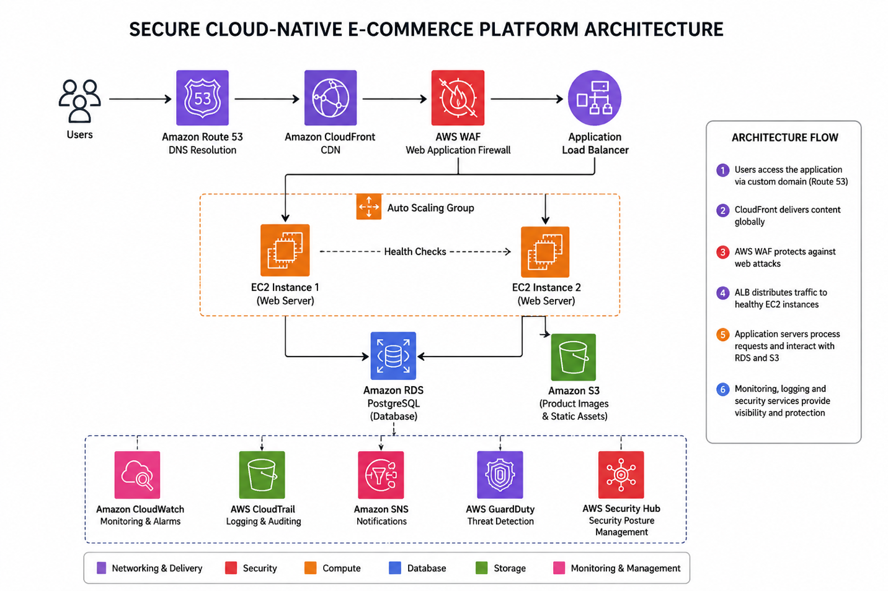
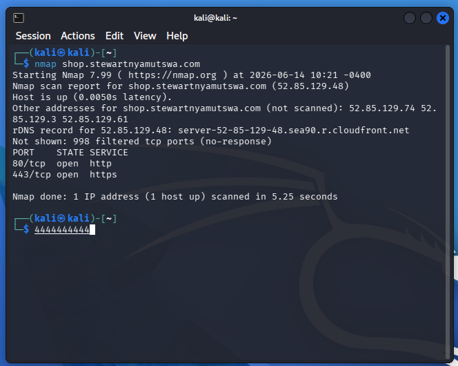
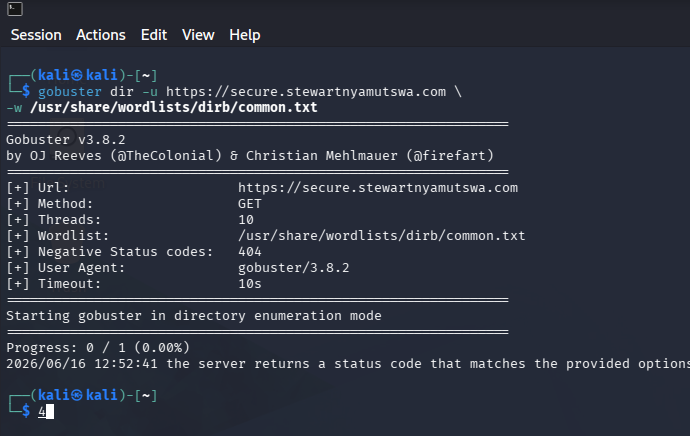

# Secure Cloud-Native E-Commerce Platform on AWS

> **A highly available web application built with layered AWS security**

## Project Summary

Stewart Secure Shop is a production-style e-commerce application deployed on AWS.

The platform uses Route 53, CloudFront, AWS WAF, an Application Load Balancer, two EC2 application servers, Amazon RDS PostgreSQL, and Amazon S3. CloudWatch, CloudTrail, GuardDuty, Security Hub, and AWS Config provide monitoring and security visibility.

I deployed the infrastructure with CloudFormation so that the environment was repeatable instead of being built manually each time.

## Why I Built This

My goal was to design and deploy a secure, highly available web application using AWS best practices. I wanted to gain practical experience with infrastructure as code, private networking, load balancing, managed databases, web application security, and cloud monitoring while understanding how these services work together in a real deployment

## Technologies Used

- AWS CloudFormation
- Amazon Route 53
- Amazon CloudFront
- AWS WAF
- Application Load Balancer
- Amazon EC2
- Auto Scaling
- Amazon RDS PostgreSQL
- Amazon S3
- Amazon CloudWatch
- AWS CloudTrail
- Amazon GuardDuty
- AWS Security Hub
- AWS Config
- Flask
- Gunicorn
- Nginx
- GitHub Actions

## Architecture

```text
Users
  │
  ▼
Route 53
  │
  ▼
CloudFront
  │
  ▼
AWS WAF
  │
  ▼
Application Load Balancer
  │
  ▼
Auto Scaling Group
  ├── EC2 application server 1
  └── EC2 application server 2
              │
              ▼
     Amazon RDS PostgreSQL

Amazon S3 ───► Product images

Monitoring:
CloudWatch | CloudTrail | GuardDuty | Security Hub | AWS Config
```

## Engineering Journey

### Step 1 — Design

I designed a multi-tier VPC with public subnets, private application subnets, and private database subnets across multiple Availability Zones.

Only the load balancer was directly reachable from the public traffic path. The application servers and database remained private.

<p align="center">
  <a href="./assets/image-13.png">
    
  </a>
</p>

<p align="center"><em>Architecture.</em></p>

### Step 2 — Build

I divided the infrastructure into multiple CloudFormation stacks so that networking, compute, database, and supporting services could be deployed and troubleshot separately.

<p align="center">
  <a href="./assets/image-02.png">
    
  </a>
</p>

<p align="center"><em>CloudFormation.</em></p>

The application ran on Ubuntu using Flask, Gunicorn, and Nginx. PostgreSQL stored application data, while S3 stored product images and relevant logs.

### Step 3 — Secure

I secured the application by allowing only the required network traffic between AWS services. The web servers and database were placed in private subnets so they couldn't be accessed directly from the internet.

<p align="center">
  <a href="./assets/image-12.png">
    
  </a>
</p>
<p align="center"><em>AWS Environment.</em></p>

I also protected the application with AWS WAF and enabled CloudTrail, CloudWatch, GuardDuty, Security Hub, and AWS Config to monitor activity, detect potential threats, and help identify security issues.

<p align="center">
  <a href="./assets/image-06.png">
    
  </a>
</p>
<p align="center"><em>AWF WAF.</em></p>

### Step 4 — Test

I tested the application the same way a real user would access it. Instead of connecting directly to the web server, I visited the website through the custom domain and confirmed that requests passed through CloudFront, AWS WAF, the Application Load Balancer, and finally reached the EC2 application servers. 

I also verified that the application could communicate with Amazon RDS and retrieve images stored in Amazon S3.

<p align="center">
  <a href="./assets/image-01.png">
    
  </a>
</p>

<p align="center"><em>Web Page.</em></p>

I confirmed that both EC2 targets were healthy, the custom domain worked, the database returned product data, images loaded correctly, and AWS security services recorded relevant activity.

<p align="center">
  <a href="./assets/image-04.png">
    
  </a>
</p>

<p align="center"><em>Load Balancer.</em></p>

### Step 5 — Validate

After deploying the environment, I validated that the infrastructure was functioning securely by performing controlled security assessments against my own application. I used Nmap to verify that only the intended ports and services were exposed and Gobuster to identify any unintentionally accessible directories or files.

<p align="center">
  <a href="./assets/image-14.png">
    
  </a>
</p>

<p align="center"><em>NMAP Scan.</em></p>

<p align="center">
  <a href="./assets/image-15.png">
    
  </a>
</p>

<p align="center"><em>Gobuster Scan.</em></p>

I also reviewed the results in CloudTrail, CloudWatch, GuardDuty, and Security Hub to confirm that the generated activity was logged and monitored correctly. This helped verify both the security controls and the monitoring capabilities of the environment.

<p align="center">
  <a href="./assets/image-11.png">
    
  </a>
</p>

<p align="center"><em>WAF Results after scan.</em></p>

## Challenges & Troubleshooting

### The load balancer marked both servers unhealthy

I traced the request from the load balancer to Nginx and Gunicorn. The issue was in the application listening and health-check path rather than the load balancer itself.

### S3 returned AccessDenied

The image path worked only after I corrected the bucket and CloudFront permissions.

### The application could not connect to PostgreSQL

I checked the endpoint, credentials, security groups, network path, and SSL requirement one layer at a time until the connection succeeded.

### CloudFront made troubleshooting less obvious

A failure at the origin could appear to be a CloudFront problem. I learned to test each layer independently before testing the entire path.

### WAF required tuning

Some controlled requests were initially allowed. I reviewed managed-rule configuration, rule priorities, and rate-limit values until the behavior matched the design.

## Results

- Deployed a custom-domain e-commerce application
- Distributed traffic across two healthy EC2 servers
- Kept application servers and RDS in private subnets
- Stored product data in PostgreSQL
- Delivered product images from S3
- Used CloudFront as the public delivery layer
- Protected the application with AWS WAF
- Enabled AWS-native security and operational monitoring
- Made the infrastructure repeatable with CloudFormation

## Lessons Learned

This project showed me that securing a cloud application involves much more than deploying it successfully. Every component—from networking and compute to storage, monitoring, and security services—must be configured correctly for the environment to be secure.

Building the environment taught me AWS services. Troubleshooting the full request path taught me cloud engineering.

