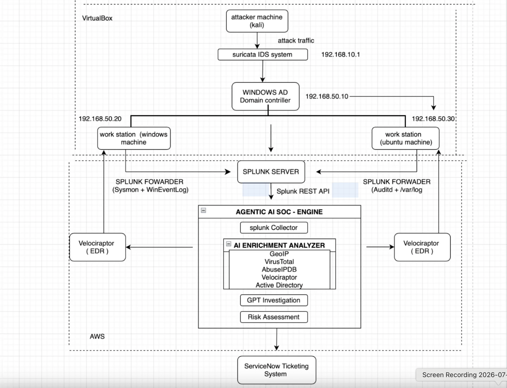
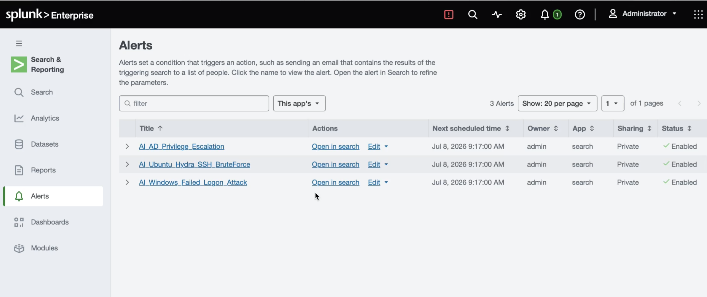
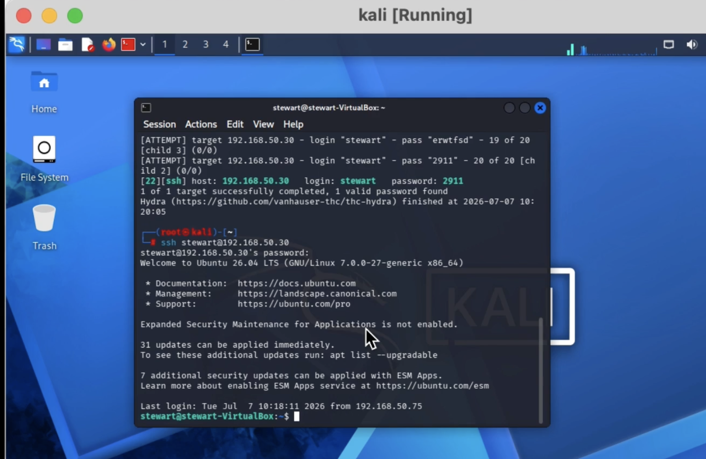
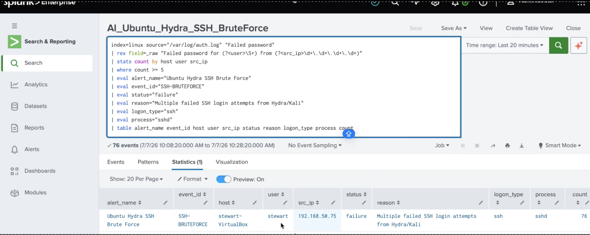
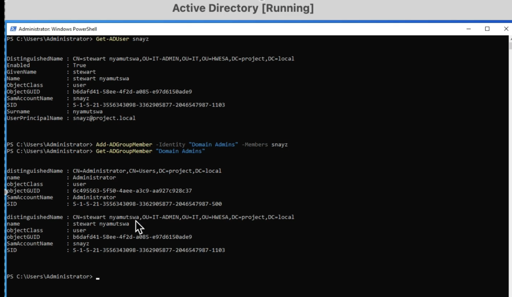
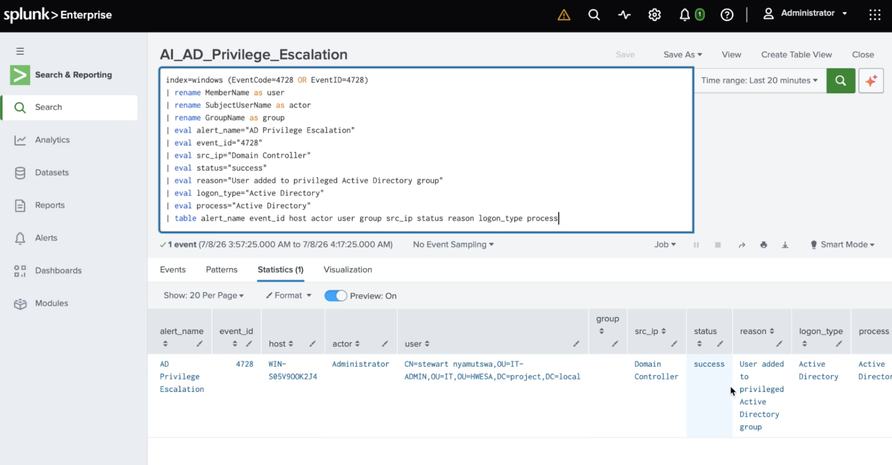
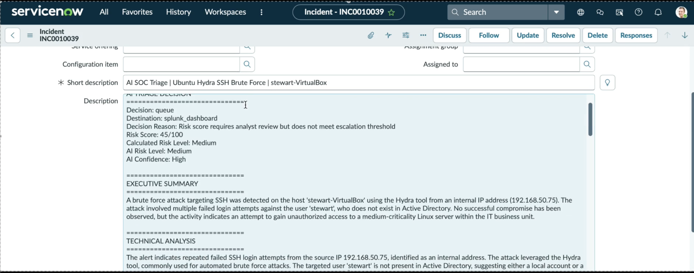
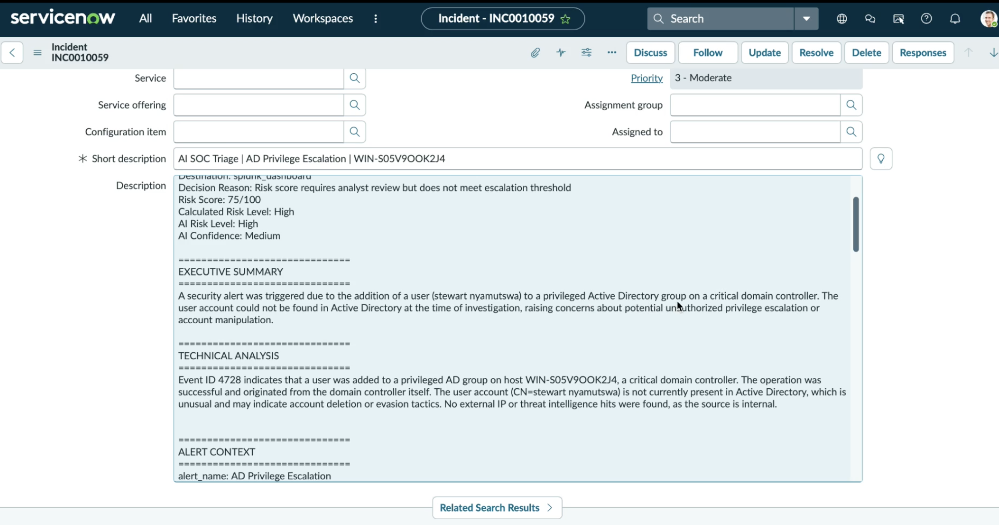

# AI-Powered SOC Investigation Engine

> **Turn a Splunk alert into an analyst-ready security incident**

## Project Summary

Security analysts often need to check several tools before they can understand what an alert really means.

I built this project to automate that first stage of the investigation. The engine retrieves alerts from Splunk, gathers identity, asset, geolocation, and threat-intelligence context, generates an AI-assisted investigation report, assigns a risk score, and creates a ServiceNow incident for analyst review.

The goal was not to replace the analyst. It was to reduce repetitive investigation work and present the available evidence in one place so the analyst could make a faster and better-informed decision.

## Why I Built This

When a SOC analyst receives an alert, the first question is usually not how to fix it. The first question is what actually happened.

Answering that often requires checking the affected user, reviewing the asset, looking up the source IP address, searching threat-intelligence services, and identifying the attack technique.

I built this platform to collect that information automatically and turn a raw Splunk alert into a structured investigation that an analyst could review and act on.

## Technologies Used

- Splunk Enterprise
- Splunk Universal Forwarder
- Splunk REST API
- Python
- FastAPI
- OpenAI API
- Active Directory
- GeoIP
- VirusTotal
- AbuseIPDB
- CMDB data
- ServiceNow
- Windows Security Events
- Ubuntu
- Kali Linux
- MITRE ATT&CK
- CIS Controls

## Architecture

```text
Ubuntu, Windows, and Active Directory
                 │
                 │ Security logs
                 ▼
          Splunk Enterprise
                 │
                 │ REST API
                 ▼
     AI SOC Investigation Engine
       ├── Active Directory context
       ├── CMDB asset context
       ├── GeoIP
       ├── VirusTotal
       └── AbuseIPDB
                 │
                 ▼
       Investigation and risk score
                 │
                 ▼
          ServiceNow incident
                 │
                 ▼
        SOC analyst review and response
```

## Engineering Journey

### Step 1 — Design

I designed the workflow so that every tool had one clear responsibility.

Splunk handled detection. The investigation engine collected additional context. AI summarized the evidence and explained the risk. ServiceNow tracked the incident, while the analyst remained responsible for the final decision.

This made the workflow easier to understand, test, and troubleshoot.

<p align="center">
  <a href="./assets/image-01.png">
    
  </a>
</p>

<p align="center"><em>Architecture of the AI-powered investigation workflow.</em></p>

### Step 2 — Build

I configured Splunk Universal Forwarders on Ubuntu and Windows systems so that security events could be collected and analyzed in Splunk.

I then built a Python service that retrieved alerts through the Splunk REST API, converted different event types into a common format, gathered additional context, generated an AI-assisted investigation report, calculated a risk score, and created a ServiceNow incident.

<p align="center">
  <a href="./assets/image-08.png">
    
  </a>
</p>

<p align="center"><em>Splunk detection rules used to identify suspicious activity.</em></p>

### Step 3 — Secure

I used dedicated service accounts with only the permissions needed to retrieve alerts and create incidents.

The engine also handled missing information carefully. When a threat-intelligence source returned no result, the report marked that information as unavailable instead of assuming the indicator was safe.

### Step 4 — Test

I tested the platform with several attack scenarios to confirm that alerts were detected, enriched, analyzed, and converted into ServiceNow incidents.

For each scenario, I first confirmed the original activity, then checked the Splunk detection, and finally reviewed the complete investigation workflow.

#### SSH Brute-Force Attack

I generated repeated SSH login attempts from Kali Linux and confirmed that the activity was detected in Splunk.

<p align="center">
  <a href="./assets/image-05.png">
    
  </a>
</p>

<p align="center"><em>Controlled SSH brute-force activity generated from Kali Linux.</em></p>

#### Linux Authentication Failures

I reviewed the failed authentication events in Splunk and confirmed that the detection logic grouped the activity correctly.

<p align="center">
  <a href="./assets/image-06.png">
    
  </a>
</p>

<p align="center"><em>Linux authentication failures detected in Splunk.</em></p>

#### Active Directory Privilege Escalation

I generated an Active Directory privilege-escalation scenario by adding a user to a privileged group and confirmed that the Windows security event was detected.

<p align="center">
  <a href="./assets/image-02.png">
    
  </a>
</p>

<p align="center"><em>Active Directory privilege-escalation activity.</em></p>

#### Windows Security Events

I verified that Windows security events were forwarded successfully and could be searched and investigated in Splunk.

<p align="center">
  <a href="./assets/image-03.png">
    
  </a>
</p>

<p align="center"><em>Windows security events collected in Splunk.</em></p>

### Step 5 — Validate

After testing the attack scenarios, I confirmed that the complete workflow operated as expected.

The engine retrieved the correct Splunk alert, collected the available identity, asset, geolocation, and threat-intelligence context, generated an investigation report, assigned a risk score, mapped the activity to relevant MITRE ATT&CK techniques and CIS Controls, and created a ServiceNow incident for analyst review.

#### Enriched SSH Brute-Force Incident

<p align="center">
  <a href="./assets/image-07.png">
    
  </a>
</p>

<p align="center"><em>ServiceNow incident enriched with investigation details for the SSH brute-force alert.</em></p>

#### Enriched Active Directory Incident

<p align="center">
  <a href="./assets/image-04.png">
    
  </a>
</p>

<p align="center"><em>ServiceNow incident created for the Active Directory privilege-escalation alert.</em></p>

## Challenges & Troubleshooting

### Creating Reliable Splunk Detections

Creating a search that matches one test event was straightforward. Creating a useful detection required choosing the right fields, threshold, and time window.

I improved the searches by reviewing the raw events and adjusting the detection logic until the results were consistent.

### Handling Different Log Formats

Linux SSH events and Windows Active Directory events use different field names and structures.

I converted the important information from each event into one common format so the enrichment and investigation stages could process both types of alerts.

### Limited Threat-Intelligence Results

Most systems in my lab used private IP addresses, so public threat-intelligence services often returned little or no information.

Instead of treating a missing result as proof that an address was safe, the platform clearly stated that public reputation information was unavailable.

### Generating Useful AI Reports

The quality of the AI investigation report depended on the quality of the information provided to it.

I improved the reports by sending structured evidence from Splunk, Active Directory, asset records, and threat-intelligence sources instead of sending only the original alert.

## Results

- Built an automated investigation workflow from Splunk to ServiceNow
- Detected multiple Windows and Linux attack scenarios
- Retrieved alerts automatically through the Splunk REST API
- Collected identity, asset, geolocation, and threat-intelligence context
- Generated AI-assisted investigation reports
- Assigned risk scores based on the available evidence
- Mapped alerts to MITRE ATT&CK techniques and CIS Controls
- Created analyst-ready ServiceNow incidents
- Reduced repetitive first-stage investigation work

## Lessons Learned

This project showed me that detecting suspicious activity is only the beginning of a SOC investigation.

The real challenge is gathering enough context to understand what happened, who or what was affected, and whether the alert represents a genuine security incident.

I also learned that AI is most useful when it is supported by reliable detections and structured evidence. The analyst still needs to review the findings, validate the conclusion, and decide how to respond.

## Video Demonstration
